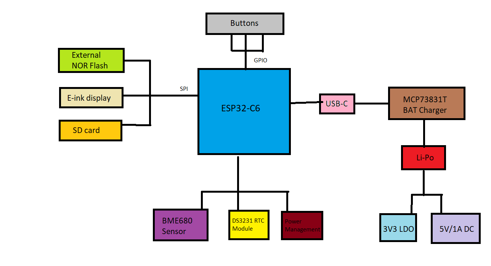

# Proiect TSC - Openbook e-book reader

Project link: https://ocw.cs.pub.ro/courses/tsc/proiect2025

## Introduction

For this project, I have implemented an open source e-book reader using ***Autodesk Fusion360***.
The architecture is based on an ESP32-C6 low power microcontroller (+ Wi-Fi & Bluetooth).

The display is using e-paper ink. The project supports micro SD reading through the specialized
interface and USB type C charging for a Polymer Lithium-Ion battery, prioritizing performance
and efficient power consumption.

## Diagram


## Contents

```
- hardware      -> .brd and .sch files of the board
- mechanical    -> .zip files of project's 3D models (standard and exploded view)
- Manufacturing -> Bill of Materials (BOM), Pick and Place (PnP), Gerber files (.zip)
- images        -> Snapshots of project
- LICENSE
- README.md
```

## Implementation & Workflow

1. **Implementation of the schematic**: The deskassistant library, offered by the lecture, was used. All components placed, linked and tagged
   for easier workflow in the PCB part.
2. **PCB**: Board was trimmed to fit specifications and accomodate busses. Components were then placed, respecting the DRC constraints file and routed
accordingly. Power(0.3mm) and data(0.15mm) lines were routed with different gauges and power routing was done mostly on top layer.
3. **3D Modelling**: All components were researched online and their specific 3D model was imported in the library. For a better grasp of the components used,
check BOM below. After the PCB was succesfully modelled, a battery and e-paper display were sketched from scratch.
4. **Fitting everything**: PCB, battery and display were fitted inside the given encasing and given a photoshoot. :-)

## Bill of Materials (with links)

| Name                                             | Link                                                                 | Datasheet                                                            |
|--------------------------------------------------|----------------------------------------------------------------------|----------------------------------------------------------------------|
| 112A-TAAR-R03                                    | [Link](https://store.comet.srl.ro/Catalogue/Product/43497/)         | [Datasheet](https://store.comet.bg/download-file.php?id=27596)      |
| 744043680                                  | [Link](https://eu.mouser.com/ProductDetail/Wurth-Elektronik/744043680?qs=PGXP4M47uW6VkZq%252BkzjrHA%3D%3D) | [Datasheet](https://www.we-online.com/components/products/datasheet/744043680.pdf) |
| BD5229G-TR                                       | [Link](https://componentsearchengine.com/part-view/BD5229G-TR/ROHM%20Semiconductor) | [Datasheet](https://datasheet.datasheetarchive.com/originals/distributors/Datasheets_SAMA/f2b9741ef86007909f138d561a359946.pdf) |
| Button                                           | [Link](https://industry.panasonic.com/global/en/products/control/switch/light-touch/number/evqpuj02k) | [Datasheet](https://industry.panasonic.com/global/en/downloads?tab=catalog&small_g_cd=203&part_no=EVQPUJ02K&q=RVZRUFVKMDJLJTdDMTMlN0MyMDMlN0MzNDU5JTdDMSU3QyU3QzIlN0M%3D) |
| Capacitor                                   | [Link](https://componentsearchengine.com/part-view/CC0402MRX5R5BB106/YAGEO) | [Datasheet](https://componentsearchengine.com/Datasheets/2/CC0402MRX5R5BB106.pdf) |
| CPH3225A                                         | [Link](https://www.snapeda.com/parts/CPH3225A/Seiko+Instruments/view-part/?ref=eda) | [Datasheet](https://www.snapeda.com/parts/CPH3225A/Seiko%20Instruments/datasheet/) |
| DS3231SN RTC                                     | [Link](https://www.snapeda.com/parts/DS3231SN%23/Analog+Devices/view-part/?ref=eda) | [Datasheet](https://www.snapeda.com/parts/DS3231SN%23/Analog%20Devices/datasheet/) |
| ESP32 WROVER 0805 Capacitor                      | [Link](https://ro.mouser.com/ProductDetail/KYOCERA-AVX/SD0805S020S1R0?qs=jCA%252BPfw4LHbpkAoSnwrdjw%3D%3D) | [Datasheet](https://ro.mouser.com/datasheet/2/40/schottky-3165252.pdf) |
| ESP32 WROVER BME680 Sensor                       | [Link](https://www.snapeda.com/parts/BME680/Bosch/view-part/?welcome=home) | [Datasheet](https://www.snapeda.com/parts/BME680/Bosch%20Sensortec/datasheet/) |
| ESP32 WROVER MCP73831           | [Link](https://eu.mouser.com/ProductDetail/Microchip-Technology/MCP73831T-2ACI-OT?qs=yUQqVecv4qvbBQBGbHx0Mw%3D%3D) | [Datasheet](https://eu.mouser.com/datasheet/2/268/MCP73831_Family_Data_Sheet_DS20001984H-3441711.pdf) |
| ESP32 WROVER P-Channel MOSFET                    | [Link](https://componentsearchengine.com/part-view/DMG2305UX-7/Diodes%20Incorporated) | [Datasheet](https://www.diodes.com//assets/Datasheets/DMG2305UX.pdf) |
| ESP32-C6 WROOM-1-N8                              | [Link](https://www.snapeda.com/parts/ESP32-C6-WROOM-1-N8/Espressif+Systems/view-part/?ref=eda) | [Datasheet](https://www.snapeda.com/parts/ESP32-C6-WROOM-1-N8/Espressif%20Systems/datasheet/) |
| ESP32C6 Varistor 1812                            | [Link](https://ro.mouser.com/ProductDetail/EPCOS-TDK/B72520T0350K062?qs=dEfas%2FXlABIszF52uu7vrg%3D%3D) | [Datasheet](https://www.tdk-electronics.tdk.com/inf/75/db/CTVS_14/Surge_protection_series.pdf) |
| FH34SRJ-24S-0.5SH Connector                      | [Link](https://componentsearchengine.com/part-view/FH34SRJ-24S-0.5SH(99)/Hirose) | [Datasheet](https://www.hirose.com/en/product/document?clcode=CL0580-1255-6-99&productname=FH34SRJ-24S-0.5SH(99)&series=FH34SRJ&documenttype=2DDrawing&lang=en&documentid=0000990903) |
| LED 0603                                    | [Link](https://www.snapeda.com/parts/KP-1608SURCK/Kingbright/view-part/?ref=search&t=LED%200603) | [Datasheet](https://www.snapeda.com/parts/KP-1608SURCK/Kingbright/datasheet/) |
| LTSPICE Resistor 0402                            | [Link](https://componentsearchengine.com/part-view/R0402%201%25%20100%20K%20(RC0402FR-07100KL)/YAGEO) | [Datasheet](https://www.yageo.com/upload/media/product/products/datasheet/rchip/PYu-RC_Group_51_RoHS_L_12.pdf) |
| MAX17048G+T10                 | [Link](https://www.snapeda.com/parts/MAX17048G+T10/Analog+Devices/view-part/?ref=eda) | [Datasheet](https://www.snapeda.com/parts/MAX17048G+T10/Analog%20Devices/datasheet/) |
| MBR0530 Schottky                           | [Link](https://www.snapeda.com/parts/MBR0530/Onsemi/view-part/?ref=eda) | [Datasheet](https://www.snapeda.com/parts/MBR0530/ON%20Semiconductor/datasheet/) |
| PGB1010603MR                            | [Link](https://www.snapeda.com/parts/PGB1010603MR/Littelfuse/view-part/?ref=eda) | [Datasheet](https://www.snapeda.com/parts/PGB1010603MR/Littelfuse%20Inc./datasheet/) |
| QWIIC Connector                                  | [Link](https://eu.mouser.com/ProductDetail/Adafruit/4208?qs=PzGy0jfpSMtbScLbr0L5dw%3D%3D) | [Datasheet](https://www.youtube.com/watch?v=dQw4w9WgXcQ) |
| RCL CPOL 3528                                    | [Link](https://www.snapeda.com/parts/TAJB475K025RNJ/AVX/view-part/?ref=dk&t=capacitor%203528&con_ref=None) | [Datasheet](https://s3.amazonaws.com/snapeda/datasheet/TAJB475K025RNJ_AVX.pdf) |
| SI1308EDL-T1-GE3 MOSFET                          | [Link](https://www.snapeda.com/parts/SI1308EDL-T1-GE3/Vishay+Siliconix/view-part/?ref=eda) | [Datasheet](https://www.youtube.com/watch?v=dQw4w9WgXcQ) |
| SJ                                               | [Link](https://grabcad.com/library/solder-jumpers-1)                 | [Datasheet](https://www.youtube.com/watch?v=dQw4w9WgXcQ)             |
| TPTP20R                                          | [Link](https://easyeda.com/component/7524403feb2642ac9f9f26dfb93ceacf) | [Datasheet](https://easyeda.com/component/7524403feb2642ac9f9f26dfb93ceacf) |
| USB4110-GF-A USB                             | [Link](https://componentsearchengine.com/part-view/USB4110-GF-A/GCT%20(GLOBAL%20CONNECTOR%20TECHNOLOGY)) | [Datasheet](https://gct.co/files/drawings/usb4110.pdf)             |
| USBLC6-2SC6Y USB                | [Link](https://www.snapeda.com/parts/USBLC6-2SC6Y/STMicroelectronics/view-part/?ref=eda) | [Datasheet](https://www.snapeda.com/parts/USBLC6-2SC6Y/STMicroelectronics/datasheet/) |
| W25Q512JVEIQ Flash                      | [Link](https://www.snapeda.com/parts/W25Q512JVEIQ/Winbond+Electronics/view-part/?ref=eda) | [Datasheet](https://www.snapeda.com/parts/W25Q512JVEIQ/Winbond%20Electronics/datasheet/) |
| XC6220A331MR-G Voltage Regulator                 | [Link](https://componentsearchengine.com/part-view/XC6220A331MR-G/Torex) | [Datasheet](https://product.torexsemi.com/system/files/series/xc6220.pdf) |

## Conclusions

This project was very exciting for me. A lot of difficulties came from me having little to no prior experience with the autodesk suite, but everything sorted
itself out. I feel that I could get a good grasp of what working in the hardware and product industry means and am open to work on more other such projects! :-)
